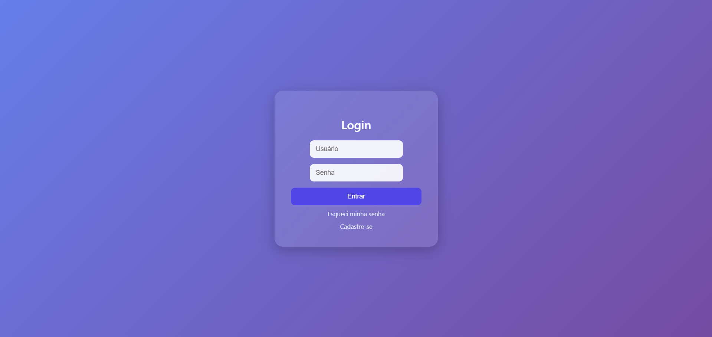
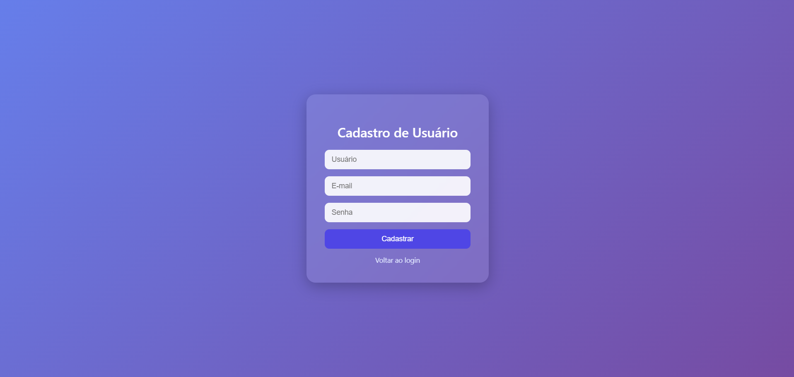
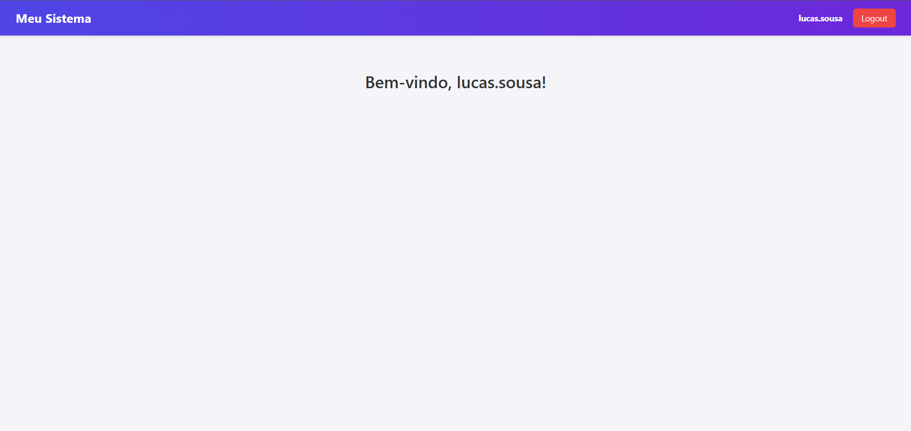
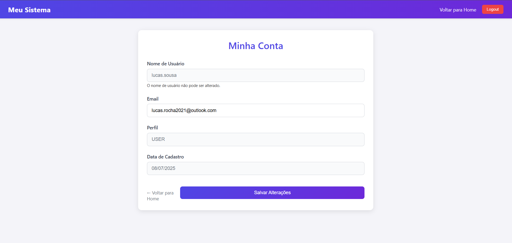

# Sistema de Autenticação e Segurança Spring

<a href="https://spring.io" target="_blank">
  
</a>

<br>

## Descrição

Este projeto implementa um sistema completo de autenticação e segurança utilizando Spring Boot e Spring Security. Ele oferece recursos de gerenciamento de usuários, controle de acesso baseado em roles, e diversas funcionalidades relacionadas à segurança de aplicações web.

## Tecnologias Utilizadas

- Java 17 LTS
- Spring Boot 3.5.3
- Spring Security
- Spring Data JPA
- Thymeleaf
- PostgreSQL
- Spring Mail

## Funcionalidades

- Autenticação de usuários
- Autorização baseada em roles
- Cadastro de usuários
- Recuperação de senha via e-mail
- Proteção contra ataques comuns (CSRF, XSS, etc.)
- Interface web com Thymeleaf
- Mensagens de erro personalizadas
- Conta de usuário

## Pré-requisitos

- JDK 17+
- Maven 3.6+
- Banco de dados (PostgreSQL)

## Instalação e Configuração

1. Clone o repositório:
   ```bash
   git clone https://github.com/Lucas-Sousa-Rocha/security.git
   ```

2. Configure o banco de dados no arquivo `application.properties` ou `application.yml`.

3. Compile e execute o projeto:
   ```bash
   ./mvnw spring-boot:run
   ```

4. Acesse a aplicação em [http://localhost:8080/login](http://localhost:8080)

## Configuração do Banco de Dados

O projeto suporta vários bancos de dados. Para configurar, edite o arquivo de propriedades conforme necessário:

### PostgreSQL
```
spring.datasource.url=jdbc:postgresql://localhost:5432/Security
spring.datasource.driver-class-name=org.postgresql.Driver
spring.datasource.username=USUARIO
spring.datasource.password=SENHA
spring.jpa.hibernate.ddl-auto=update
spring.jpa.show-sql=true
spring.jpa.properties.hibernate.format_sql=true
``` 

## Configurando o E-mail

```
spring.mail.host=smtp.gmail.com
spring.mail.port=587
spring.mail.username=${EMAIL_USERNAME}
spring.mail.password=${EMAIL_PASS}
spring.mail.properties.mail.smtp.starttls.required=true
spring.mail.properties.mail.smtp.connectiontimeout=5000
spring.mail.properties.mail.smtp.timeout=5000
spring.mail.properties.mail.smtp.writetimeout=5000
``` 

- Substitua `${EMAIL_USERNAME}` e `${EMAIL_PASS}` pelos dados do seu e-mail.
- Substitua `smtp.gmail.com` pelo servidor SMTP do seu e-mail.
- Verifique se seu email estar habilitado para envio de e-mails.
- Caso use o gmail utilize a opção de senha de aplicativo.

## Estrutura do Projeto
```
├── src/
│   ├── main/
│   │   ├── java/
│   │   │   └── com/lucas_sousa_rocha/security/
│   │   │       ├── config/                      # Configurações do Spring e Security
│   │   │       ├── controller/                  # Controladores MVC
│   │   │       ├── dto/                         # Objetos de transferência de dados (DTOs)
│   │   │       ├── model/                       # Entidades JPA
│   │   │       ├── repository/                  # Repositórios Spring Data
│   │   │       ├── service/                     # Serviços de negócio
│   │   └── resources/
│   │       ├── static/                          # Recursos estáticos (CSS, JS, etc.)
│   │       ├── templates/                       # Templates Thymeleaf
│   │       └── application.properties           # Configurações da aplicação
│
├── test/                                        # Testes unitários e de integração
└── pom.xml


``` 

## Capturas de Tela

- http://localhost:8080/security/login


- http://localhost:8080/security/register


- http://localhost:8080/security/forgot-password


- http://localhost:8080/security/reset-password?token= TOKEN ENVIADO PARA O EMAIL


- http://localhost:8080/security/home


- http://localhost:8080/security/my-account
  

## Desenvolvimento

Para contribuir com o projeto:

1. Crie um fork do repositório
2. Crie uma branch para sua feature (`git checkout -b feature/nova-funcionalidade`)
3. Faça commit das alterações (`git commit -m 'Adiciona nova funcionalidade'`)
4. Envie para o GitHub (`git push origin feature/nova-funcionalidade`)
5. Abra um Pull Request

### Implantação 

```
mvn package
```

```
bash ./mvnw clean package java -jar target/security-0.0.1-SNAPSHOT.jar
``` 

## Licença

Este projeto está licenciado sob a [Licença MIT](LICENSE).

## Contato

Lucas Sousa Da Rocha - [luca.rocha2021@outlook.com]

Link do Projeto: [https://github.com/Lucas-Sousa-Rocha/security](https://github.com/Lucas-Sousa-Rocha/security)

---

## Agradecimentos
```
- Spring Boot
- Spring Security
- Todos os contribuidores
```
